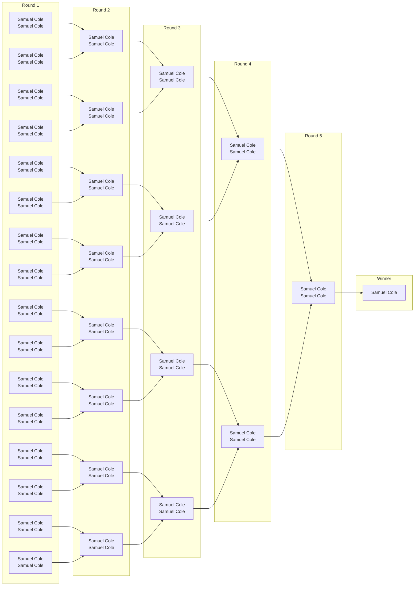

# wimblepong

```mermaid
    flowchart LR;
        1[Samuel Cole\nSamuel Cole]
        2[Samuel Cole\nSamuel Cole]
        3[Samuel Cole\nSamuel Cole]
        4[Samuel Cole\nSamuel Cole]
        5[Samuel Cole\nSamuel Cole]
        6[Samuel Cole\nSamuel Cole]
        7[Samuel Cole\nSamuel Cole]
        8[Samuel Cole\nSamuel Cole]
        9[Samuel Cole\nSamuel Cole]
        10[Samuel Cole\nSamuel Cole]
        11[Samuel Cole\nSamuel Cole]
        12[Samuel Cole\nSamuel Cole]
        13[Samuel Cole\nSamuel Cole]
        14[Samuel Cole\nSamuel Cole]
        15[Samuel Cole\nSamuel Cole]
        16[Samuel Cole\nSamuel Cole]
        17[Samuel Cole\nSamuel Cole]
        18[Samuel Cole\nSamuel Cole]
        19[Samuel Cole\nSamuel Cole]
        20[Samuel Cole\nSamuel Cole]
        21[Samuel Cole\nSamuel Cole]
        22[Samuel Cole\nSamuel Cole]
        23[Samuel Cole\nSamuel Cole]
        24[Samuel Cole\nSamuel Cole]
        25[Samuel Cole\nSamuel Cole]
        26[Samuel Cole\nSamuel Cole]
        27[Samuel Cole\nSamuel Cole]
        28[Samuel Cole\nSamuel Cole]
        29[Samuel Cole\nSamuel Cole]
        30[Samuel Cole\nSamuel Cole]
        31[Samuel Cole\nSamuel Cole]
        32[Samuel Cole]

        1 --> 17 --> 25 --> 29 --> 31 --> 32
        2 --> 17
        3 --> 18 --> 25
        4 --> 18
        5 --> 19 --> 26 --> 29
        6 --> 19
        7 --> 20 --> 26
        8 --> 20
        9 --> 21 --> 27 --> 30 --> 31
        10 --> 21
        11 --> 22 --> 27
        12 --> 22
        13 --> 23 --> 28 --> 30
        14 --> 23
        15 --> 24 --> 28
        16 --> 24

        subgraph Round 1
            1
            2
            3
            4
            5
            6
            7
            8
            9
            10
            11
            12
            13
            14
            15
            16
          end
        subgraph Round 2
            17
            18
            19
            20
            21
            22
            23
            24
        end
        subgraph Round 3
            25
            26
            27
            28
        end
        subgraph Round 4
            29
            30
        end
        subgraph Round 5
            31
        end
        subgraph Winner
            32
        end
```
